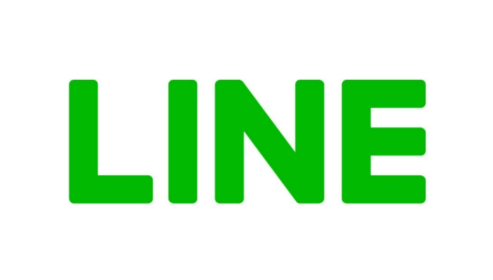
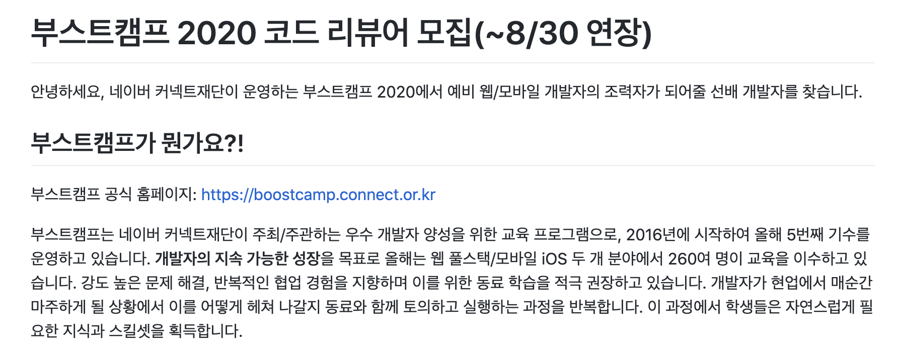
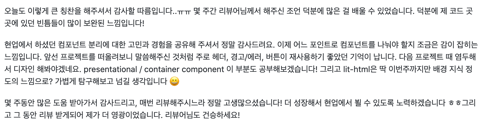
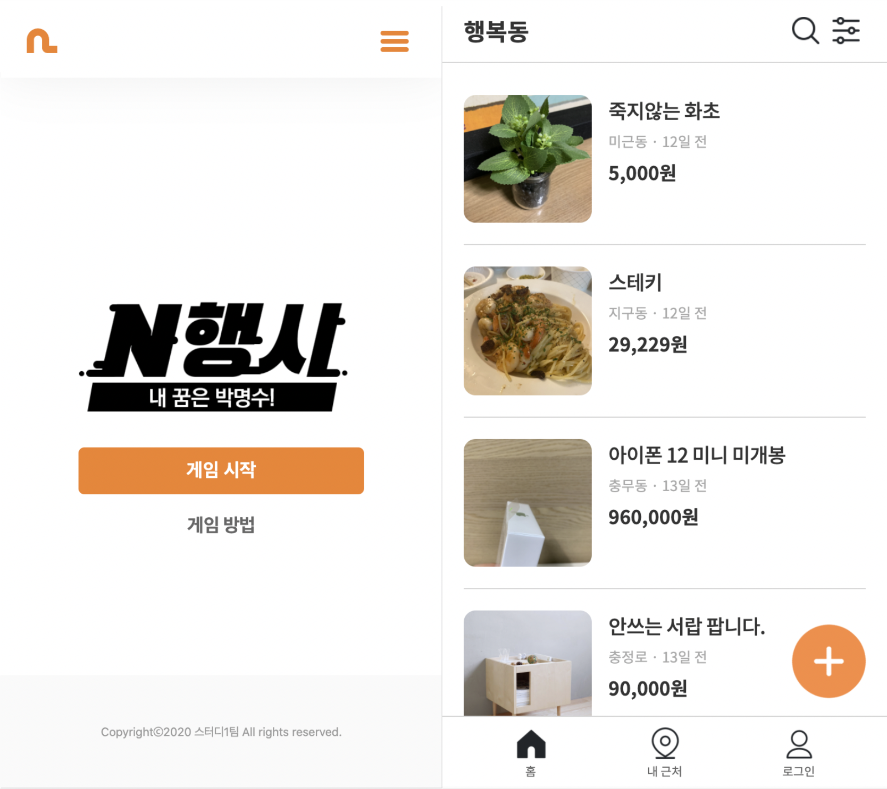

# ADIOS 2020 :airplane:

## intro

2020년도가 끝이 났다.   올해는 CORONA-19로 인해 개인적으로 더 정신없는 한 해가 지나간 것 같다.  원래 친구들과 술 한잔하면서 축구 이야기던 앞으로 창업에 대한 이야기던 주저리주저리 하는 것을 좋아하는데 그러지 못해 많아아쉬웠다. :mask:

이직이라는 큰 이벤트도 있었고, 코로나로 집에 있는 생활들이 길어지면서 이런저런 에피소드가 있었던 것 같은데, 한 번 기록으로 남기면 좋지 않을까 해서 첫 포스팅을 회고록으로 작성한다.

---

## 이직 :boxing_glove:

CORONA-19로 인해 내가 맡은 프로젝트가 좌초됐고, 병역 특례 종료와 맞물려 결과적으로 이직을 결정하게 되었다.  
첫 이직 때는 회사를 다니면서 이직을 준비했고, 면접으로 인한 잦은 연차와 일과 과제의 병행이 힘들었다.  
이번 이직 과정은 퇴사 후 이직이라는 선택지로 결정했고 이직은 병역 특례가 끝나는 시점이기도 해서 학교로의 복학도 고민해 봐야 했다.  
하지만 아직 주니어 딱지를 못 떼었다 생각했고, 적어도 좋은 문화를 가진 기업에서 미들급 엔지니어로 성장하고 싶은 마음이 컸다.
조건을 가지고 이직을 고민했다.

1. 매력적인 문화를 가진 회사
2. 이미 인프라가 모두 갖춰져있는 큰 기업
3. 핀테크 (optional)

이런 조건들을 가진 회사를 찾아 지원했고, 라인 파이낸셜에 최종 합격하여 입사하게 되었다.   학생 때도 선망하던 회사를 간다는게 너무 기뻤고 다른 회사의 오퍼를 받기도 전에 회사를 선택했다.
어떻게 보면 천재지변..? 때문에 이직을 결심하게 되었는데, 이런 경험이 내가 살면서 얼마나 될까 궁금하긴 하다. IMF 때 고생하셨던 선배님들을 뒤따라 내가 코로나 세대가 된 것 같고.. 결과적으로 IT업계라서 영향이 크지 않았던게 다행이긴 했다.

## 부스트캠프 리뷰어

18년도, 19년도에 걸쳐 코딩과외도 했었어서 부트캠프나 온라인강의에 관심이 많았다.  
그러던 와중 아래와 같은 공고가 올라왔다. 코드리뷰는 항상해왔던것이기 때문에 문제는 없었고 부스트캠프 학생들은 공부를 어떻게할까 궁금해서 지원하게 되었다.
   

 
부스트캠프 마스터님(교수님)의 코드를 리뷰하는 간단한 테스트 후에 리뷰어로 활동하게 되었다.

이번 부스트 캠프는 대략적으로 아래와 같이 진행되었는데 나는 여기서 개인프로젝트 스프린트 세션의 리뷰어를 담당했다.

1. 챌린지 코스(부스트캠퍼가 되는 선발과정)
2. 개인프로젝트 스프린트
3. 팀프로젝트

총 6분의 캠퍼분들이 나에게 배정되었다.

- 코드가 잘 설계되었는지
- 사용자에게 유용한 기능을 제공하는지
- UI 변경이 합리적이고 보기 좋은지
- 병렬 작업이 안전하게 실행되는지
- 불필요하게 복잡하진 않은지
- 지금 당장 필요없는 기능을 개발하진 않았는지
- 유닛 테스트가 적절한지
- 테스트는 잘 설계되었는지
- 모든 이름을 잘 지었는지
- 주석은 명료하고 유용한지, *무엇*보다는 *왜*를 나타내는지
- 문서에 반영이 되었는지
- 스타일 가이드를 따르는지

평소에 즐겨 사용하던 코드 리뷰 원칙에 따라 리뷰 했고, 내가 부족한 부분들은 다른 리뷰어 분들 리뷰를 조금 참고하여 리뷰하기도 했다.  
내가 리뷰를 해도 괜찮은 건지 싶을 정도로 멋있는 캠퍼분 들도 계셨다. 개인 프로젝트 스프린트는 바닐라 JS로만 코딩이 가능했는데, 캠퍼 중에 한 분은 react의 컨셉을 차용해서 직접 라이브러리를 설계하기도 하셨다. (속으로 박수 쳤다 :clap:)
전체적으로 매주 발전하는 모습이 보여 뿌듯했고, 나도 설계 관점에서 리뷰했기에 observer 패턴 등 되짚어 볼 수 있어 오히려 나에게도 좋은 기간이었다.

## React Study 운영

결론부터 말하면 뿌듯함은 컸지만 은근히 힘들었다 ㅋㅋ..  
마크업 개발자 지인분들이 React를 배우고 싶은데 스터디를 개설해 주면 안되냐는 말을 들었고, 부스트캠프에서 경험한 스프린트 형식의 스터디를 해보고 싶기도 해서 스터디를 개설하였다.  
수요자였던 지인분들과 캠퍼스픽에 스터디원 모집글을 올려 9명정도의 인원을 모았다.  
원래 스터디라 하면, 같이 공부하고 성장하는 게 맞지만 이번에는 멘토 역할만 하고 공부는 같이 안 하겠다(?)라고 생각하고 진행했다.  

부스트캠프 방식에서 많이 차용해서 진행했고 총 3개월 코스로 진행한 과정은 아래와 같았다.

1. React 기초 (velopert님 강의)
2. 개인 프로젝트 스프린트
3. 팀 프로젝트

첫 번째 과정인 React 기초는 벨로퍼트님의 강의를 카테고리화해 나눴고 공부해서 매주 발표하는 스터디를 진행했다.
이 부분은 순조롭게 잘 진행됐고, 스터디원의 이탈도 없었다.

두 번째 과정에서는 에어비앤비 클론 과제를 진행했다. 큰 요구사항은 없고 에어비앤비의 첫 화면과 결과 화면을 React로 구현하라는 과제였다. 코드는 개개인이 작성하되, 각 3명으로 팀을 묶어 피어리뷰를 진행하게 했다.  
여기서 내가 알고 있었지만, 간과한 게 React는 Js공부가 선행되어야 한다는 것이다. 본업이 있으신 분들이 많은 수 이탈했고, 스터디원은 2/3정도 인원으로 줄었다.  
팀프로젝트를 진행하려면 인원을 맞춰야 했기에 급하게 충원했고 9명은 맞춘상태로 두번째 과정을 종료시켰다.

세 번째 과정은 팀 프로젝트였다. 개인 프로젝트에서 나누었던 팀을 그대로 하고 자유롭게 주제를 선택하도록 했다.  
한 달의 기간을 기획, 디자인(optional),개발,qa의 프로세스를 나눠 기간을 역산하게 했다. 한달동안 매주 스프린트를 진행하게 했고, 각 팀의 pm을 정해 팀 일정을 관리시켰다. standuply라는 툴의 도움을 받아 매일 개인의 일정을 체크하게 스프린트를 진행했다.  
스터디원 각각의 일정이 있음에도 불구하고 팀프로젝트에 몰입해주었고, 좋은 결과물들이 많이 나왔다.

어떤 팀은 힙한 스택을 많이 써서 storybook에 표현하기도 하고 어떤 팀은 직접 디자인해서 창작해서 이쁜 결과물을 만들기도 했다.
스터디원들이 팀 프로젝트에서 얻어 간 게 많을지는 모르겠으나.. 개인적으로는 결과물도 나오고, 코드리뷰와 끝없는 회의를 통해 같이 일하는 것을 많이 익혔다고 생각한다.
앞으로 2기 스터디를 할지는 모르겠지만, 한다면 또다시 스프린트 방식이지 싶다.

## 끝

쓰다 보니, 기록인지 회고인지.. 했던 일을 나열하게 되는 것 같다. 이렇게 하는지는 잘 모르겠으나 첫 회고를 해보니 한 해를 되돌아 보고 다음 해에는 어떤 목표를 달성할까 고민하는 것만으로도 의미 있는 것 같다.
성인이 된 후 매년 다사다난 했지만, 2020년도는 더욱 그랬던 것 같다. 올해도 옆에서 잘 응원해준 사람에게도, 이직 축하해 준 분들에게도 너무 감사한 한 해였다.

확실히 정한건 아니지만, 2021년도의 목표는 아래와 같이 하려 한다.

1. 컨퍼런스 발표
2. 라인 뱅크의 성공적인 개발
3. 영어회화 정복

내년 회고 때 목표를 달성할 수 있길 바란다. 다음 포스팅은 상세한 이직기 OR 스토리북에 대한 게 될 것 같다.
