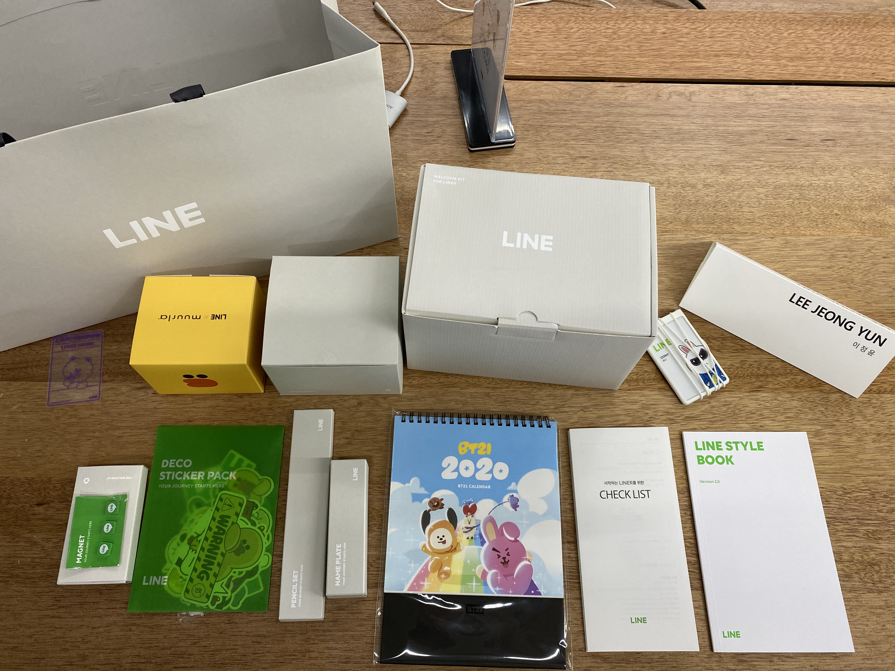
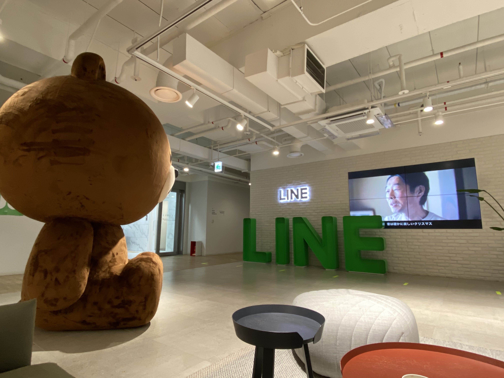

# 이직 :boxing_glove:

CORONA-19로 인해 내가 맡은 프로젝트가 좌초됐고, 병역특례 종료와 맞물려 결과적으로 이직을 결정하게 되었다.  
첫 이직 때는 회사를 다니면서 이직을 준비했고, 면접으로 인한 잦은 연차와 일과 과제의 병행이 힘들었다.  
이번 이직 과정은 퇴사 후 이직이라는 선택지로 결정했고 이직은 병역특례가 끝나는 시점이기도 해서 학교로의 복학도 고민해 봐야 했다.  
하지만 아직 주니어 딱지를 못 떼었다 생각했고, 적어도 좋은 문화를 가진 기업에서 미들급 엔지니어로 성장하고 싶은 마음이 컸다.
조건을 가지고 이직을 고민했다.

1. 매력적인 문화를 가진 회사
2. 이미 인프라가 모두 갖춰져있는 큰 기업
3. 핀테크 (optional)

1번. 이전 직장에서 멋있는 시니어 분들이 만드신 개발 문화를 누렸다. 스탠드업, 코드리뷰, 스터디와 같은 문화로 인해 많이 성장했고 이런 문화가 기반이된 회사에서 성장해야 더욱 빠르게 성장한다는 것을 알고 있었다.

2번. 앞선 두 번의 회사에서 스타트업을 경험했다면, 인프라가 갖춰져있는 큰 IT 회사들은 어떻게 다르길래 사람들이 선망할까? 에 대한 호기심이 강했다. 스타트업에서 개발했던 내 경험이 MAU가 1000만이 넘는 회사들에서도 좋게 작용할까? 여러고민들이 있었다. 말로만 들어서는 감이 잘 안왔기에 직접 경험해보고 싶었다.

3번. 이전 직장에서 대출 관련 서비스와 기관투자 EMS 등을 개발했었고, 복잡하지만 풀어내는 재미가 있는 핀테크 도메인이 난 좋았다. 그래서 필수는 아니지만 기왕이면 핀테크 회사로 가면 좋겠다는 생각도 있었다.

이런 생각들을 가지고 회사를 구하기 시작했다.

### 과정

최근 IT 회사들의 채용 프로세스는 아래와 같다.

서류 -> 코딩 테스트(과제) -> 1차 면접 -> 2차 면접

이번 이직에서의 난관은 코딩테스트였다. 학부 때 알고리즘 수업을 듣기도 전에 휴학한 나로선 정말 정말 싫었다..  
일단..테스트보자고 마음먹고 위에서 말한 기업들을 서류 접수했다. 다행히 프로젝트 경험을 좋게 봐주셔서 서류는 대부분 합격을 받았다.

회사 A

힘들다고 유명한 스타트업이지만, 해당 앱의 헤비 유저기도 하고 친한 친구가 그곳에서 20대를 쏟아붓고 있기에 분명 이유가 있을 거라 생각해서 지원했다.  
결과: 기술면접 탈락  
이유: 본 회사는 개인적으로 다른 회사에 비해 과제를 열심히 진행했다고 생각한다. 때문에 기대하고 있었지만, 면접에서 Vue core에 대한 대답을 잘 하지 못했고 탈락으로 이어졌다고 생각한다.  

회사 B

국내에서 it기업의 금융 자회사로, 핀테크 도메인을 가지고 MAU가 많은 곳에서 일하는 좋은 기회라 생각하여 지원했다.  
결과: 기술면접 탈락  
이유: 코딩 테스트는 통과했다. 면접에서 간단한 알고리즘 테스트를 본 후, 여러 질문을 받았는데, 프론트면접임에도 불구하고 인프라 질문이 많아 당황했다. 나중에 들어보니 API Gateway를 작성하는 포지션이었다고 한다..  

회사 C

스타트업으로 최근 MAU 1000만을 달성한 기업이다. 핀테크 도메인도 아니었지만, 빠른 성장 속에 이유가 있을 거라 생각해 경험해보고자 지원했다.  
결과: 2차 면접 결과 대기중 포기  
이유: 라인 입사를 더 원했기에 포기했다.  

회사 D,E..  
다른 많은 회사들을 지원했고, 2차 면접 결과 대기 또는 1차 면접 합격 후 포기했다.

회사 LINE

현 직장으로 회사 자체는 이미 선망하는 회사였고, 거기다 핀테크 도메인으로 뱅킹,페이 서비스등을 만들 기회였기에 지원하지 않을 이유가 없었다.  
결과: 최종합

라인 채용프로세스는 아래와 같았다.

1. 서류
2. 코딩테스트
3. 1차면접
4. 2차면접
5. 레퍼런스 체크 및 처우 협의

서류 단계가 코로나 상황으로 인해 상당히 늦게 발표되었다. 신기하게도 A 회사를 탈락한 날 서류 합격이 발표되었다.  
코딩 테스트는 알고리즘과 구현이 섞인 3문제로 출제되었고, 결과가 만점이었기에 기대하고 있었다.  
1차 면접 때는 타 회사와의 면접과는 다르게 React보다는 Js의 코어적인 질문을 많이 해주셨다. fundamental의 중요성을 다시 알게 되었다.  
2차 면접은 솔직히 잘못 봤다... 다만, 휴학 상황에서 입사를 하는 게 맞는 건가에 대한 질문이 있으셨고, 후자에 대한 생각은 확고 했기에 감사하게도 좋게 봐주신 것 같다.  
라인은 특이하게 채용과정안에 레퍼런스 체크가 있다. 외주를 통해 레퍼런스콜을 진행하게 되는데, 팀장이 들어가는것이 권고 사항이었다.  
이전 직장 두곳에서 같이 일했던 분들의 이름을 작성했고, 레퍼런스콜은 원활하게 잘되었다. (도와주신 분들 다시한번 감사드립니다. :bow:)
최종적으로 처우 협의 후 입사했다.

## LINE

이미 공백기가 있었기에 1주일정도?만 쉬고 입사했다.

목표했던 기업에 도달해서 기쁜 마음이 컸다. 왜 큰 회사 큰 회사 하는지 알게해주는 좋은 복지도 있었고, 멋있는 동료도 많았다. (일단 웹 팀의 인원이 전 직장 전 직군 엔지니어수와 똑같다..) 확실히 배울 수 있는 폭이 넓다.
현재는 적응기를 다 마치고 본격적으로 프로젝트를 준비 중이다. 앞으로 여러 난관이 있겠지만 잘 해낼 거라 믿는다.
조금 자세히 작성했어야 됐는데 급하게 마무리하는 감이 없지 않아있다. 추후에 또 수정하는 걸로 하고.. 오늘은 여기까지!
