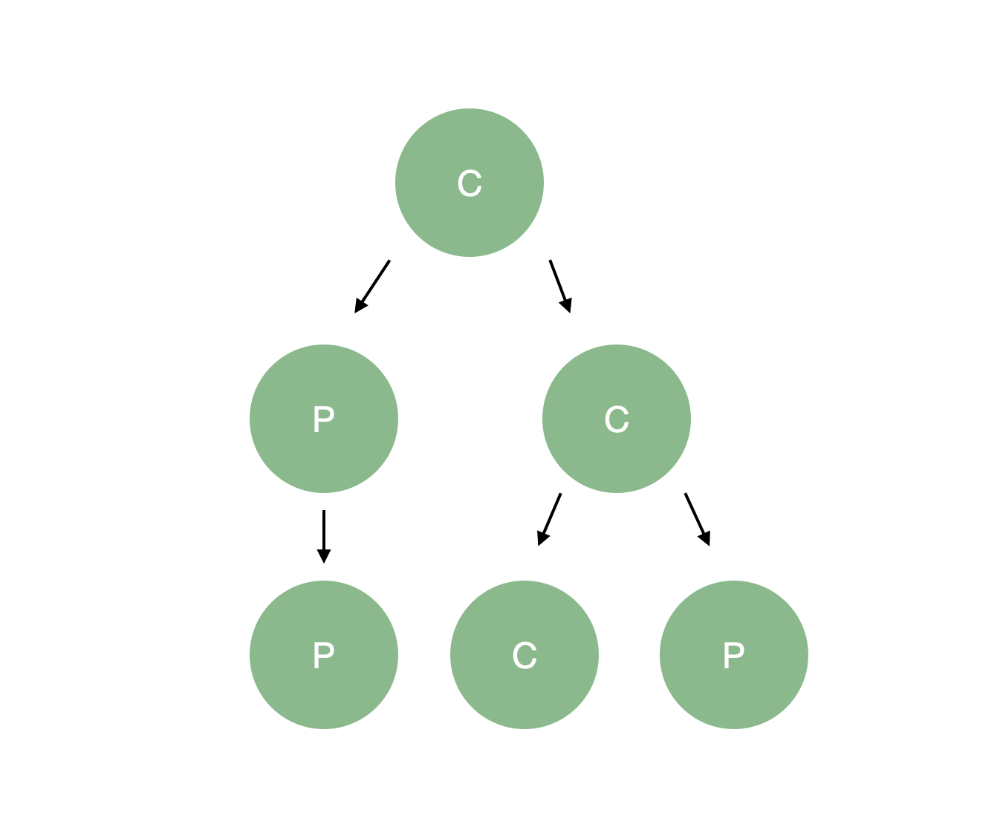

직전 직장 다닐때 Storybook관련 정리한 것을 포스팅하려한다.
프론트엔드 프로젝트에 Storybook을 도입한 계기와 방법을 설명한다.

<!-- excerpt -->

# 들어가며

최근 많은 기업에서 도입하고 있는 Storybook을 왜 도입하였고, 도입하면서 있었던 어떤 우여곡절을 소개해드리려 한다.

# 왜 Storybook을 도입했나요?

렌딧에는 접근이 까다로운 여러 페이지가 있었다. 예를 들어 '대출 마이페이지'를 접근하기 위한 조건은 다음과 같다.
<br>

1. 대출 신청을 진행한다.
2. 어드민에서 대출 신청을 승인하는 과정을 거친다.
3. 전자약정을 약정을 진행한다.
4. 대출 마이페이지에 접속한다.


이러한 이유로... 새로운 요구 사항이 생겼을 때 프론트엔드 개발자와 디자이너가 해당 페이지를 테스트하고 개발하기 여간 쉽지 않았다. 많은 사람들이 불필요한 시간을 소모하는 상황을 어떻게 개선하면 좋을지 고민하는 가운데 좋은 대안으로 떠오른 것이 바로 **Storybook**이었다.

Storybook을 운용함으로서 찾아가기 어려운 페이지들을 모두 노출시켜 프론트엔드 개발자 및 기획자가 더욱 수월하게 UI 검토를 할 수 있게 되고, UI 개발 중 디자이너와 프론트엔드의 사이의 커뮤니케이션도 향상되는 효과를 기대할 수 있다. 또한 Storybook 상에서 UI 테스트가 가능하게 되므로 테스팅 환경이 더 좋아진다는 장점이 생기게된다. 여러 가지 측면을 놓고 검토한 결과 팀 내에서 많은 이득을 얻을 수 있을 것 같아서 Storybook을 도입하기로 결정했다.

# Storybook을 도입하기 전 준비운동

Storybook을 도입하기 전 우리는 백엔드 로직 및 우리 실제 배포되는 렌딧 웹사이트와 격리된 테스트 환경으로 했다.

Storybook에 컴포넌트들을 주입하려 했더니 API 응답이 없이는 특정 부분을 볼 수 없거나 페이지 전체를 볼 수 없는 환경이 생겼다. 또한 Vuex에 얽힌 로직도 존재해 이에 대한 처리도 필요했다. 결국 백엔드에 의존하지 않고는 스토리북에서 화면을 제대로 검증하기 어렵게 됐다.

프론트엔드 챕터에서는 View, Logic을 분리하는 방법을 여러 가지 중 흔히 React.js에서 흔히 사용되는 **Presentational & Container Component** 구조를 선택하게 되었다.. 스토리북 공식 가이드에서도 해당 구조를 추천하고 있었다.

Presentational & Container(이하 P-C) 구조에서는 아래와 같이 컴포넌트가 두 종류로 구분된다.

- 로직은 전혀 신경 쓰지 않고 화면만 관심사로 가지는 **Presentational Component** (이하 P 컴포넌트)
- Vuex, Router 및 서버와의 통신을 위한 로직을 담당하는 **Container Component** (이하 C 컴포넌트)

현재 복잡하게 뷰와 로직이 섞여 있는 컴포넌트들을 각각 P 컴포넌트와 C 컴포넌트로 분리하여 P 컴포넌트만 Storybook에 탑재하여 외부 의존성과 상관없이 view를 검증이 가능하다.
따라서 P-C 구조로 컴포넌트들을 우리의 명확한 기준에 의해 쪼개면 Storybook만을 위한 코드를 수선하는 일이 없으니 안성맞춤이었다.

하지만 항상 그렇듯이 방법론이 있다고 바로 코드에 적용하는 것은 쉽지 않다.. 구조를 분리하다 보니 P가 C를 포함하는 상황이 생겼다. 원저자는 허용한다 했으나(지금은 원저자도 말을 바꾸었네요..) 스토리북에서는 P구조가 C를 포함하게 되면 로직이 따라 들어가게 되어 맞지 않는 옷이 되었다. 그래서 우리는 우리만의 기준을 세우고 그것을 명확히 지키기로 결정했고 기준은 다음과 같다.

<br>

- 스토리북에 붙이는 단위는 단위별 P 컴포넌트를 나열

- 개발 시에는 단위별 P - C 컴포넌트 구조를 적용

- C 컴포넌트에서 slot으로 다른 C 컴포넌트를 slot으로 주입

- C 컴포넌트를 가지는 P 컴포넌트는 존재하지 않는다.

- C-C 간 통신

구조는 다음과 같다.


기준을 세웠으니 우리는 P-C 구조를 명확하게 분리하면 된다.
간단한 예시로 살펴보자.

대출 완료 페이지의 일부를 발췌해 왔다. \*실제 코드와는 상이한 부분이 있다.

Container Component

```html
<template>
  <InvestComplete
    v-loading="loading"
    :auto-invest-activated="autoInvestActivated"
  />
</template>

<script>
import api from '~/api'
import InvestComplete from './InvestComplete.vue'
export default {
  data() {
    return {
      autoInvestActivated: false,
      loading: false,
    }
  },
  methods: {
    async getOrderResult() {
      this.loading = true
      try {
        const { result } = await api('/api/').get({})
        this.autoInvestActivated = result.autoInvestActivated
      } catch (error) {
        // error
      }
      this.loading = false
    },
  },
}
```

Presentational Component

```html
<template>
  <div title="투자 완료" class="invest-complete-container">
    <div class="link-container">
      <LdLink>
        지급 스케줄 보기
      </LdLink>
      <LdLink>
        결제내역 확인하기 <LdIcon :size="16" name="next" />
      </LdLink>
    </div>
    <template #bottom>
      <div class="contents-container">
        ... 중략
      </div>
    </template>
  </div>
</template>
<script>
export default {
  props: {
    autoInvestActivated: Boolean,
  },
}
</script>
<style lang="scss" scoped>
<style lang="scss" scoped>
.invest-complete-container {
  @include pc {
    width: 372px;
    margin: 0 auto;
  }
}
```

앞서 보신 구조 그림처럼 C 컴포넌트와 P 컴포넌트가 부모-자식 관계를 가지는 것을 볼수 있다.
C 컴포넌트는 vuex와 같은 로직이 삽입되어 있고 style은 존재하지 않는다.
P 컴포넌트는 template과 style로 이루어진 view이고 데이터는 props로 받아와서 render 해준다.
이러한 구조를 가지고 있기 때문에! Storybook에서는 P 컴포넌트만을 등록하고 mock 데이터를 prop으로 주입해 주기만 하면 아름답게 붙는다. 허허!
다음 챕터에서는 이렇게 열심히 분리한 구조를 실제 Storybook을 적용해보겠다.

# Storybook을 붙여보자!

Storybook을 설치하는 방법은 [공식 문서](https://www.learnstorybook.com/intro-to-storybook/react/en/get-started/)를 참고하시면 제가 구구절절 말하는 것보다 훨씬 쉽게 적용하실 수 있다. 
(앗 따가!)</img>
기본적으로 스토리북을 설치하면 다음과 같은 두 가지 디렉터리와 하위 파일들이 된다.

```
.storybook
  > main.js
stories
  > 0-Welcome.stories.js
    Welcome.js
```

main.js는 스토리북의 기능 추가, preset, webpack 등의 설정을 하는 파일이다.

```
stories: ['../stories/**/*.stories.js'],
```

main.js에서 기본적으로 작성되어 있는 코드로 인해, stories 파일들을 모두 찾아 스토리북에 등록해준다.

<hr>

### Category 정의

Storybook은 [Component Story Format (CSF)](https://storybook.js.org/docs/formats/component-story-format/) 형식을 사용하여 문서를 작성한다. CSF를 사용할 땐 아래와 같이 `export default { }` 코드를 사용하여 어떤 문서인지, 정의한다. title은 스토리북에 보일 그룹(카테고리)를 명시한다.

```js
export default {
  title: 'page / 대출 / 신청',
}
```

하지만 이렇게 모든 페이지, 컴포넌트에 정의하게 되면 여러 사람 손을 타면서 일관성이 깨질 수가 있어 관리가 어렵게 되고, 내가 무슨 페이지를 작업하고 있는지 항상 타이핑하게 되는 번거로움이 있다. 이 문제를 해결하기 위해 유틸을 하나 생성했는데, 방법은 다음과 같다.
meta.ts

```js
export function titleOf(dirname: string, suffix: string) {
  const path = dirname.replace(/^stories\//, '')
  return suffix ? `${path}/${suffix}` : path
}
```

app.done.stories.js

```
import { titleOf } from "@/meta";
export default {
  title: titleOf(__dirname, "완료")
};
export const 일반 = () => ({
  render() {
    return (
      <MainContent>
        <LoanAppDoneNormal />
      </MainContent>
    );
  }
});
```

meta.ts에서 titleOf라는 함수를 생성한다. 해당 함수는 dirname 즉 현재 작업하고 있는 파일의 폴더 주소와 suffix를 인자로 받고 storybook의 디렉터리 구조로 맞춰준다. 이렇게 하게 되면 실제 코드 상의 stories 안에 담겨있는 폴더 구조가 그대로 storybook에도 녹여지게 된다.

<!-- <div style="display: flex; margin-top: 24px;">
  
  
</div> -->

### Story 생성

필수적으로 해야 될 세팅들을 마무리했다! 이제 직전 챕터에서 열심히 분리했던 P-C 구조 중에 P 컴포넌트만을 Storybook에 심어보자.

```
export default {
  title: titleOf(__dirname, '투자 완료'),
}
export const 기본_화면 = () => ({
  render() {
    return (
      <MainContent full>
        <InvestComplete autoInvestActivated={this.autoInvestActivated} />
      </MainContent>
    )
  },
})
```

P 컴포넌트엔 템플릿과 스타일만 담겨있기 때문에 오류 없이 화면에 말끔하게 표시된다.

<!--  -->

### Addons

기본적으로 스토리북에는 스토리를 나열하고 시각화하는 방법이 있다. Addon은 스토리북이 더 유용하게 사용할 수 있도록 여러 시각화 툴을 제공한다.

#### knobs

[knobs](https://github.com/storybookjs/storybook/tree/master/addons/knobs)는 화면상의 조작을 통해 props를 직접 변경할 수 있도록 만들어진 추가 기능이다. 컴포넌트의 props의 제어를 통해 P 화면을 수동으로 조작 가능하게 만들어준다.
props에 따라 화면이 변하는 것을 검증할 수 있고 각 props들이 대출 결과 스토리에서 number라는 knob를 생성했다. Knobs를 사용할 때 넣어주어야 하는 인자로는 Knobs의 이름, 기본값이 있다. 마지막 인자로는 GROUP ID를 하는데, Knobs가 많아 복잡해질 때 해당 인자를 사용하여 그룹을 설정할 수 있다.

```
import { titleOf } from '@/meta'
import { boolean } from '@storybook/addon-knobs'
export default {
  title: titleOf(__dirname, '투자 완료'),
}
export const 기본_화면 = () => ({
  props: {
    autoInvestActivated: {
      default: boolean('자동투자 설정 여부', false),
    },
  },
  render() {
    return (
      <MainContent full>
        <InvestComplete autoInvestActivated={this.autoInvestActivated} />
      </MainContent>
    )
  },
})
```

#### Docs

[Docs](https://github.com/storybookjs/storybook/tree/master/addons/docs)는 스토리를 문서화해 주는 애드온이다. 컴포넌트를 파싱 해 컴포넌트 내부의 props, event, docgen 주석을 자동으로 문서화해 주는 훌륭한 툴이다. 기본적으로 자동으로 만들어주는 문서를 사용해도 되지만, MDX를 지원하기 때문에 더 마크다운으로 더 상세한 문서도 작성 가능하다.
[Docs-Vue](https://github.com/storybookjs/storybook/tree/next/addons/docs/vue)를 참고하시면 Docs 애드온을 사능하다. 헌데, docs에 화면은 잘 표시가 되지만 가장 중요한 props 문서화가 작동하지 않더라구요. 거듭된 삽질 끝에 `main.js` webpack부분에 다음 코드를 추가 해야함을 알았다.(Thanks to doug ❤️)

```js
module.exports = {
  webpackFinal: async config => {
    config.module.rules = [
      {
        test: /\.vue$/,
        use: 'vue-docgen-loader',
        enforce: 'post',
      },
    ]
  },
}
```

#### Viewport

viewport는 다양한 디바이스 사이즈에 맞춰 화면을 확인 할 수 있는 툴이다.
chrome dev tools의 기능과 유사하다.

# Next Step.

Storybook을 도입하면서 P-C로의 컴포넌트 분리도 함께 이루어졌다. 결과적으로 좋은 컴포넌트의 분리는 좋은 테스트를 불러온다는 것을 깨달았다. 이제 우리는 처음 목표와 같이 기획, 디자이너, 개발자 등 이해 관계자가 불편함 없이 화면을 확인할 수 있고 화면에 대해 확신을 가진다.
Storybook을 도입한 뒤로 다음 Step은 이런 것이 있을 것 같다.

1. 더 나아가 디자인 시스템을 도입해서 컴포넌트의 통일감을 높이고 px을 확인할 필요 없이 재사용 가능한 형태로 구현되어야 한다.
2. 프론트엔드의 테스트 범위를 넓혀 단순히 눈으로 UI 확인을 하는 게 아니라 Snapshot Testing이 필요하다.
